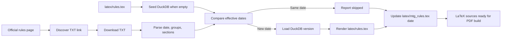

# MTG Rules ETL

## Table of Contents

- [What It Is](#what-it-is)
- [ETL Overview](#etl-overview)
- [How It Works](#how-it-works)
- [Architecture and Design Rationale](#architecture-and-design-rationale)
- [Specs and Contracts](#specs-and-contracts)
- [Data Flow](#data-flow)
- [How To Run](#how-to-run)
- [How To Test](#how-to-test)
- [How To Update](#how-to-update)
- [Operations and Troubleshooting](#operations-and-troubleshooting)
- [Logging and Error Handling](#logging-and-error-handling)
- [Security and Privacy](#security-and-privacy)
- [References](#references)

## What It Is

This project maintains an unofficial LaTeX body file for the Magic: The
Gathering Comprehensive Rules and a DuckDB copy of the parsed rule index.

The LaTeX sources live in `latex/`.

The ETL seeds DuckDB from `latex/rules.tex` when the database is missing or empty,
then checks the official Wizards rules page for the latest TXT release. If the
effective date is unchanged, the job reports `skipped`. If the date changed, it
loads the new rule groups and rule sections into DuckDB and rewrites
`latex/rules.tex` with the same chapter/section/subsection style used by the
existing LaTeX file. The job also keeps the cover/title dates in
`latex/mtg_rules.tex` aligned with the parsed official effective date, even on a
same-date `skipped` run.

## ETL Overview

This is a batch ETL for keeping the local LaTeX edition and the DuckDB rule
index aligned with the official Wizards Comprehensive Rules TXT release.

At a high level, each run does five things:

1. Initializes DuckDB if `data/mtg_rules.duckdb` does not exist yet.
2. Seeds DuckDB from the current `latex/rules.tex` when the database is empty,
   preserving the local February 27, 2026 baseline before any official update is
   fetched.
3. Extracts the official rules page, discovers the current TXT URL, downloads
   the TXT, and reads the effective date from the line that starts with
   `These rules are effective as of`.
4. Transforms the TXT into the project contract: top-level rule groups such as
   `100`, `200`, and `300`, plus specific rule sections such as `101`, `102`,
   and `103`, each versioned by `effective_date`.
5. Loads the parsed version into DuckDB and publishes the LaTeX output only when
   the official effective date is newer than the latest stored version.

DuckDB is the source of truth for stored rule versions. The LaTeX files are the
published representation used to build the PDF. If the incoming official date is
already present in DuckDB, the run is idempotent: it reports `skipped` and does
not rewrite `latex/rules.tex`, while still correcting stale effective-date text
in `latex/mtg_rules.tex` if needed.

The ETL is intentionally small and local. There is no scheduler, queue, or
SQLite fallback in the current project: running the CLI command performs one
complete extract, transform, load, and LaTeX publish cycle.

## How It Works

The entry point is:

```powershell
.venv\Scripts\python.exe -m mtg_rules_etl.cli --db data\mtg_rules.duckdb --rules-tex latex\rules.tex --cover-tex latex\mtg_rules.tex
```

Default source page: `https://magic.wizards.com/en/rules`.

The ETL discovers the TXT link from the source page. It does not hardcode the
dated TXT URL.

Main runtime stages:

| Stage | Responsibility | Main code |
| --- | --- | --- |
| Extract | Read the Wizards rules page, find the TXT release, and download it. | `mtg_rules_etl/source.py` |
| Seed | Populate DuckDB from the existing LaTeX body when the database is empty. | `mtg_rules_etl/pipeline.py`, `mtg_rules_etl/parsers.py` |
| Transform | Parse effective date, rule groups, section names, and section text. | `mtg_rules_etl/parsers.py` |
| Load | Store versioned rows in `rule_groups` and `rules` with transactional writes. | `mtg_rules_etl/repository.py` |
| Publish | Render `latex/rules.tex` and update cover/title effective-date text. | `mtg_rules_etl/latex.py` |
| Orchestrate | Compare dates, decide `updated` vs `skipped`, and emit structured logs. | `mtg_rules_etl/pipeline.py` |

## Architecture and Design Rationale

Pattern: Pipe-and-Filter with Ports and Adapters.

The pipeline is separated into extraction, parsing/validation, persistence, and
LaTeX rendering. HTTP and DuckDB are isolated behind adapters so tests can run
without the network and without a permanent database.

Local patterns:

| Pattern | Code | Purpose |
| --- | --- | --- |
| Source adapter | `mtg_rules_etl/source.py` | Fetch official HTML/TXT and constrain allowed HTTPS hosts. |
| Repository | `mtg_rules_etl/repository.py` | Own DuckDB schema and parameterized writes. |
| Use case | `mtg_rules_etl/pipeline.py` | Orchestrate one ETL run and idempotent update behavior. |
| Renderer | `mtg_rules_etl/latex.py` | Convert parsed rules to the existing LaTeX body format. |

## Specs and Contracts

The SDD spec is in `docs/specs/mtg_rules_etl.md`.

DuckDB tables:

| Table | Key | Purpose |
| --- | --- | --- |
| `rule_groups` | `(id, effective_date)` | Stores group ids such as 100, 200, 300 and their chapter names. |
| `rules` | `(id, effective_date)` | Stores rule section ids such as 100, 101, 102, with `group_id`, `name`, and `rule_text`. |

`rule_text` is plain text. Some official placeholder sections can be empty, for
example `600. General` in the June 19, 2026 rules.

## Data Flow



## How To Run

Create the virtual environment and install dependencies:

```powershell
C:\Python312\python.exe -m venv D:\code\MTG\.venv
.venv\Scripts\python.exe -m pip install -r D:\code\MTG\requirements.txt
```

Run the ETL:

```powershell
.venv\Scripts\python.exe -m mtg_rules_etl.cli --db data\mtg_rules.duckdb --rules-tex latex\rules.tex --cover-tex latex\mtg_rules.tex
```

## How To Test

The sandbox may not allow pytest to use the default Windows temp folder, so use
a workspace basetemp:

```powershell
New-Item -ItemType Directory -Force D:\code\MTG\.tmp | Out-Null
.venv\Scripts\python.exe -m pytest -q --basetemp D:\code\MTG\.tmp\pytest
```

## How To Update

| Need to change | Start here | Also check |
| --- | --- | --- |
| DuckDB schema | `mtg_rules_etl/repository.py` | `docs/specs/mtg_rules_etl.md`, repository tests |
| Official source behavior | `mtg_rules_etl/source.py` | source tests, SSRF host allowlist |
| TXT or LaTeX parsing | `mtg_rules_etl/parsers.py` | parser fixtures/tests |
| LaTeX output format and cover date replacement | `mtg_rules_etl/latex.py` | `latex/rules.tex`, `latex/mtg_rules.tex`, renderer tests |
| ETL orchestration | `mtg_rules_etl/pipeline.py` | pipeline tests and logging contract |

## Operations and Troubleshooting

Rerun is safe. The repository deletes and reloads rows for the same
`effective_date` in one transaction, so duplicate rows are not created.

If a network call fails, rerun the same command after connectivity or sandbox
permissions are fixed. A failed run may seed the old LaTeX version first; the
next successful run will continue from that state.

This ETL updates `latex/rules.tex` and the effective-date text in
`latex/mtg_rules.tex`. It does not update `latex/glossary.tex`, `latex/credits.tex`,
or the PDF unless that scope is added.

## Logging and Error Handling

CLI logs are JSON lines on stderr. Each lifecycle event includes UTC timestamp,
level, logger, message, run id, and stage. The pipeline logs start, seed,
download, parse summary, final status, and failure. It logs counts and safe URLs,
not every rule row.

Common final statuses:

| Status | Meaning |
| --- | --- |
| `updated` | The official date differed; DuckDB, `latex/rules.tex`, and stale cover dates were updated. |
| `skipped` | The official date matched the latest DuckDB date; rule loading was skipped, but stale cover dates can still be corrected. |

## Security and Privacy

The source adapter accepts only HTTPS URLs from `magic.wizards.com` for the
rules page and `media.wizards.com` or `magic.wizards.com` for TXT downloads.
DuckDB writes use parameterized statements.

## References

- Official rules page: https://magic.wizards.com/en/rules
- DuckDB Python API: https://duckdb.org/docs/stable/clients/python/overview
